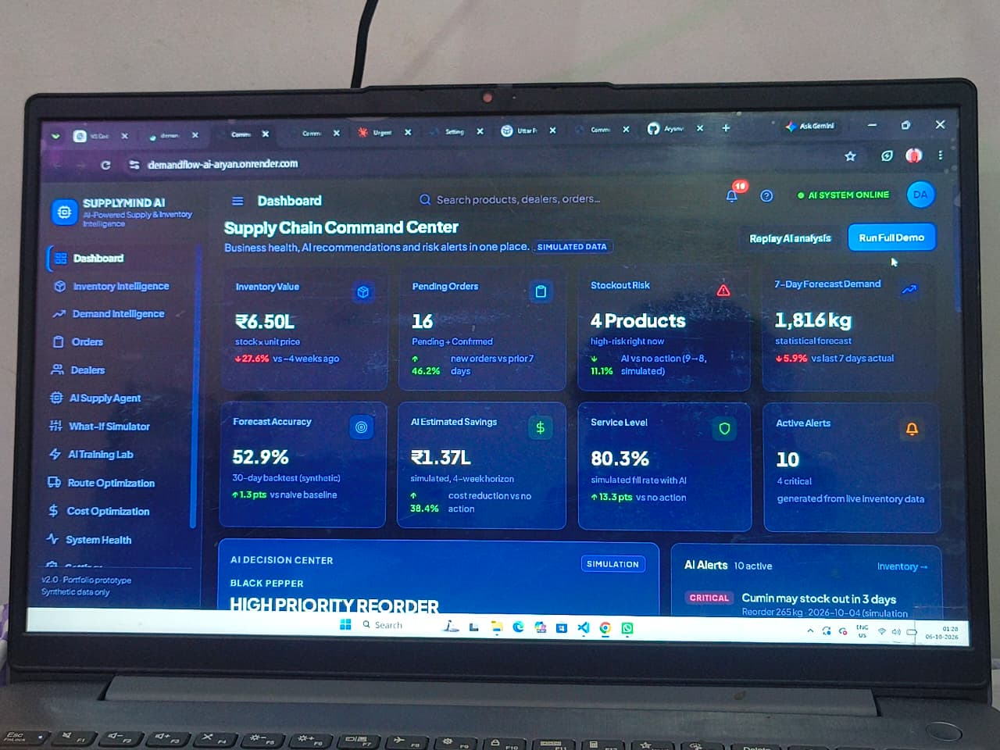
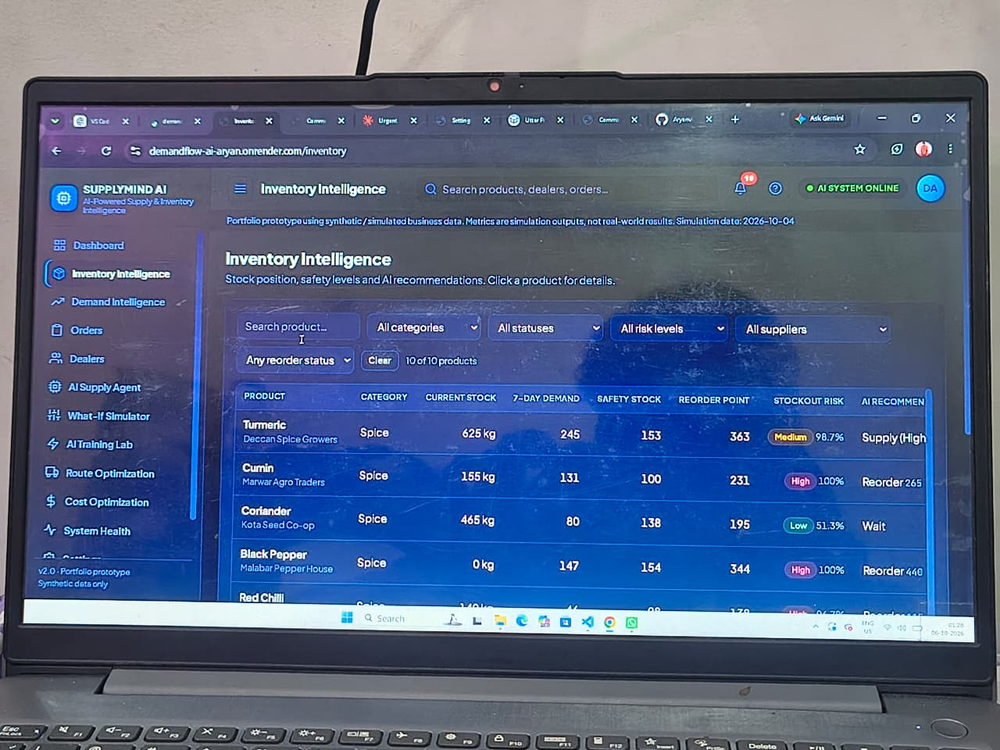
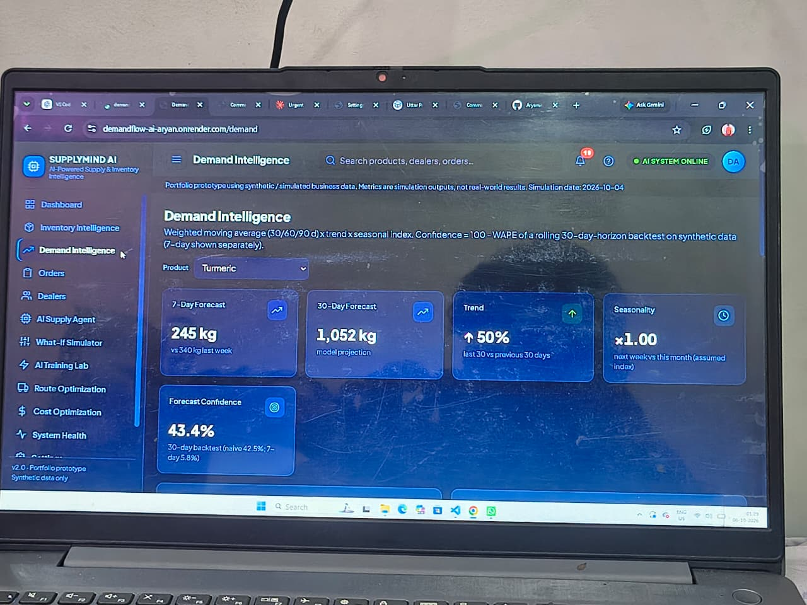
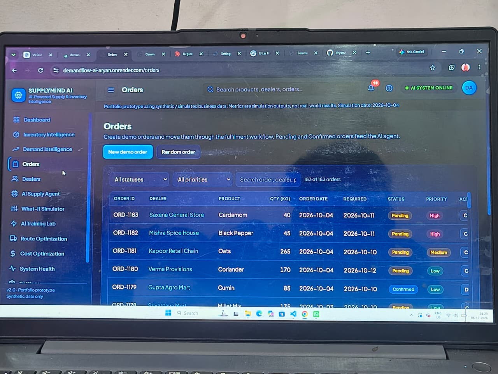

## 🚀 Live Demo

[*Launch DemandFlow AI*](https://demandflow-ai-aryan.onrender.com/)

> Deployed on Render. The first request may take some time because the service runs on the free tier.
# SupplyMind AI — AI-Powered Supply & Inventory Intelligence

> **This is a portfolio prototype using synthetic / simulated business data.** All products, dealers, orders, costs and results are fictional. Simulation outputs (savings, service level, stockout risk, accuracy) are **not** real-world production results. The internal project name is still *AI Supply Agent*.

## Project Overview
SupplyMind AI is a Flask web application for a company that **trades and distributes multigrain and spices** (not a manufacturer). It combines demand forecasting, a **Q-learning (reinforcement learning) agent**, a Monte-Carlo cost simulator and route planning into a dark SaaS "Supply Chain Command Center".

## Problem Statement
How can an AI agent learn from previous orders, inventory levels, demand patterns and delivery outcomes to decide **how much to reorder, when, and how much to supply now**, so that stockouts, excess stock and late deliveries are reduced?

## Solution
```
Historical data → Demand analysis → Inventory state → Q-learning agent → Action selection
→ Business outcome → Reward / penalty → Learning update
```
Every recommendation carries an explanation, risk level, confidence and a simulated business impact.

## Features
| Area | What it does |
|---|---|
| **Command Center** | 8 KPI cards (real calculations, with comparison basis in tooltips), AI Decision Center, AI Alerts (click for details), animated AI pipeline, learning progress, **Run Full Demo** |
| **Inventory Intelligence** | Search + 5 filters, status badges, reorder point, simulated stockout risk, product side panel with forecast and cost impact |
| **Demand Intelligence** | 7/30-day forecast, trend, seasonality, backtest charts (actual vs predicted vs naive), category demand |
| **Orders** | Create demo orders, Pending → Confirmed → Dispatched → Delivered / Returned, stock effects |
| **Dealers** | Orders, pending, revenue, risk score, priority; detail page with demand pattern and AI recommendation |
| **AI Supply Agent** | State variables, Q-values per action, selected action, confidence, reasoning, impact, Apply / Reject |
| **What-If Simulator** | Demand %, inventory, pending orders, lead time, transport cost, stockout penalty → current vs AI scenario with charts |
| **AI Training Lab** | Live training, reward charts, action distribution, Q-table, before vs after, Save / Load / Reset |
| **Route Optimization** | Simulated grid map, sequence, capacity, priority deliveries, transport cost |
| **Cost Optimization** | Holding, stockout, transport, ordering cost: current vs AI |
| **System Health** | Live component checks + automated test results (pytest) |
| **Settings** | Editable simulation parameters, brain save/load, data reset |
| **Help & Guide** | `/help`: page-by-page explanation, interactive AI workflow, live example from real data, glossary and FAQ. The `?` button in the top bar opens quick help for the current page |
## 📸 Screenshots

### 🏠 Dashboard


### 📊 Demand Forecasting


### 📦 Inventory Analysis


### 🤖 AI Recommendations

## Architecture
```
Browser (HTML/CSS/JS, Chart.js)  ──JSON──  Flask (app.py)  ──  SQLite (supply.db) ← data/*.csv
                                              ├── ai/demand_prediction.py  forecast, backtest, customer stats
                                              ├── ai/decision_engine.py    state, recommendation, risk, explanation
                                              ├── ai/q_learning.py         simulated environment + Q-learning agent
                                              └── ai/cost_model.py         Monte-Carlo cost / impact simulator
```

## Technology Stack
Python 3.9+, Flask, NumPy, Pandas, SQLite, custom Q-learning, pytest, HTML/CSS/JavaScript, Chart.js (CDN) and Google Fonts (CDN). No paid API and no API key.

## AI / ML Approach
### Q-learning
`Q(s,a) ← Q(s,a) + α [ r + γ · max Q(s',a') − Q(s,a) ]`
* **State** (27): stock cover (LOW/NORMAL/HIGH) × demand level × pending orders
* **Actions** (5): `ORDER_MORE` (2× weekly demand), `SUPPLY_HIGH` (1.5×), `SUPPLY_NORMAL` (1×), `WAIT`, `REDUCE_STOCK`
* **Rewards**: +1 correct decision, +1 avoided stockout, +1 demand satisfied, −0.5 excess, −1 stockout, −1 late supply, −0.5 unnecessary reorder; −0.3 when a human rejects a recommendation
* ε-greedy exploration decays to 0.05. "Before" = random decisions, "After" = learned greedy policy, on the same 300 seeded test episodes.
* Real recommendation quantities also respect safety stock, lead-time demand and the max-stock cap.

### Demand forecasting
Weighted moving average (30/60/90 days) × trend factor × assumed seasonal index. **Forecast confidence** is `100 − WAPE` from a rolling backtest on the synthetic orders (30-day horizon; the 7-day backtest is shown separately), compared with a naive baseline. The synthetic order stream is lumpy, so the model performs about on par with the naive baseline — this is reported as-is.

### Cost & impact simulation
A 300-run Monte-Carlo simulation (default 4 weeks) compares "no action" with the AI quantity. Holding, stockout, ordering and transport costs use **editable simulation parameters** (Settings). They are assumptions, not real costs.

## System Workflow
1. Orders arrive → pending demand  2. Forecast + inventory state  3. Agent picks an action  4. Planner applies or rejects (simulation)  5. Outcome → reward → Q-table update  6. Route planner sequences deliveries.

## Database
SQLite `supply.db`, created from `data/*.csv` on first start: `products, customers, orders, inventory, supply_history, decisions`. *Reset demo data* rebuilds it.

## Testing
```bash
pip install -r requirements-dev.txt
pytest
```
`tests/` has 87 pytest cases: page routes, APIs, invalid input, missing data, forecasting, Q-learning (update formula, greedy choice, training improvement, save/load), reward table, decision engine, cost simulator. Tests use a temporary database and never touch your data. The **System Health** page has a *Run tests* button that runs pytest and displays the real result; no results are shown until tests have actually run.

## Screenshots
Add images to `docs/screenshots/`: `command-center.png`, `ai-agent.png`, `what-if.png`, `training-lab.png`, `system-health.png`.

## How to Run
```bash
python -m venv .venv && source .venv/bin/activate     # Windows: .venv\Scripts\activate
pip install -r requirements.txt
python app.py
```
Open http://127.0.0.1:5000. Health check: http://127.0.0.1:5000/health. `python generate_data.py` regenerates the synthetic CSVs (delete `supply.db` afterwards).

## Project Structure
```
app.py                 routes + APIs        generate_data.py   synthetic data
ai/                    forecasting, Q-learning, decisions, cost model
templates/, static/    UI (css design tokens in static/css/style.css)
tests/                 pytest suite         docs/              notes
data/                  CSV data             brain/             saved Q-table
```

## Limitations
* Synthetic data and a simplified simulator: results do not predict real-world performance.
* The agent's state has no lead-time variable; the environment is small (27 states).
* Forecasting is a statistical baseline; on lumpy data it is not clearly better than a naive forecast.
* Costs, margins and capacities are simulation parameters. Delivery timestamps are not tracked, so on-time delivery rate is not computed.
* Route planning uses a simulated grid and a heuristic; no GPS, traffic or capacity-constrained routing.
* Single-user demo: no authentication; Chart.js and fonts load from a CDN.

## Future Improvements
Calibrate the simulator with real anonymised data; deep Q-network and per-product agents; multi-supplier and cost-aware rewards; capacity- and time-window-constrained routing; authentication and audit log; CI pipeline.
